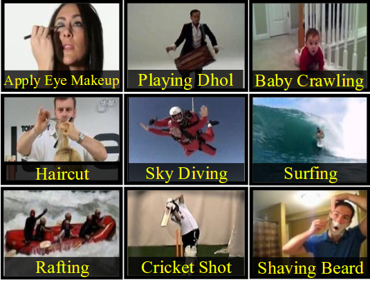
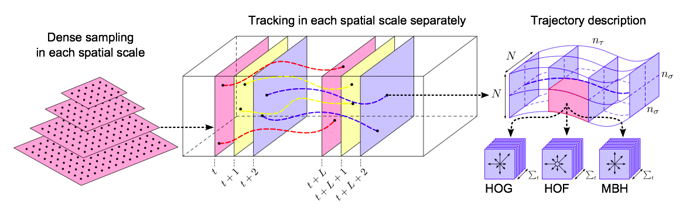
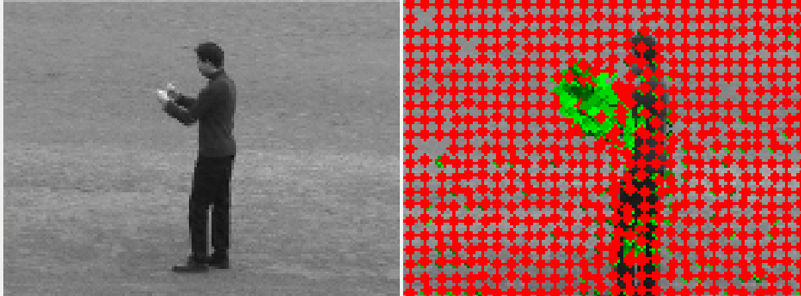
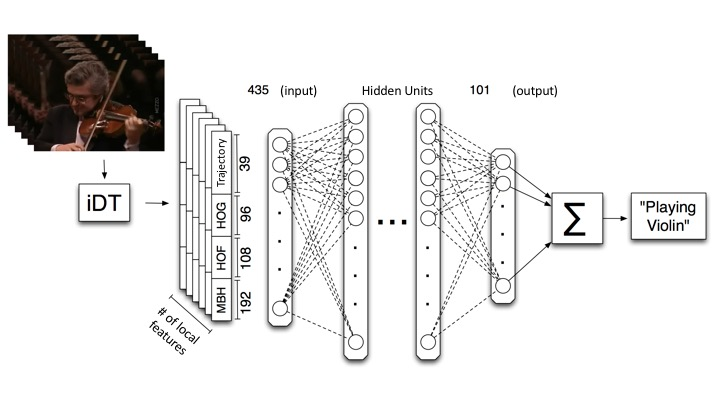
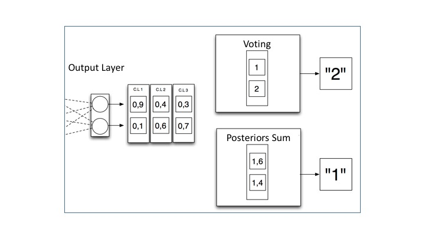

# Action Recognition with Artificial Neural Networks (Master Thesis 13/07/2015)

This repository contains the code developed to extract and process features from the dataset UCF-101 using DenseTrajectories.  

Having extracted these features, a Neural Network at trajectory-patch level is trained in order to classify the activity that is being executed in the video (i.e: playing a piano, walking, ...). In order to do that, it has been proposed different voting schemes. 

### Prerequisites

	* Extraction performed under a SunGridEngine cluster.
	* Using DenseTrajectories as feature extractor.
	* Training and evaluation performed using [deepnet](https://github.com/nitishsrivastava/deepnet) with [Eigen](http://eigen.tuxfamily.org/index.php?title=Main_Page).

### Frames of UCF-101 videos:

### [improved Dense Trajectories (iDT)](https://hal.inria.fr/inria-00583818/document):

Features are extracted around de detected movement, like a 3D patch.

Different features are extracted:

	* Histograms of Oriented Gradients (HOG) 
	* Histograms of Optical Flow (HOF) 
	* Motion Boundary Histograms (MBH)
	* Trajectory's information

All these values are composed in a 435 feature vector.

### Classification model: Neural Network

We have used a Neural Network at patch level, learning how to classify each patch into one of the 101 classes. Once the training is completed, we can extract features from one video and then classify each patch individually. 

Finally, we have used different voting schemes, i.e: posterior sum or most voted, weighting with all the patches in one video, in order to provide the final label.

This final procedure improves in every case the classification, obtaining an improvement of 40 percentual points over using just the label provided at patch level.

